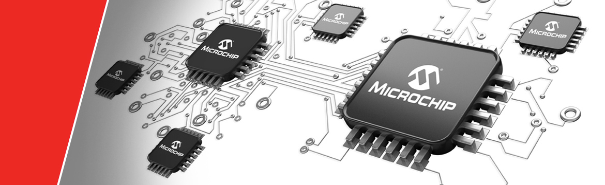
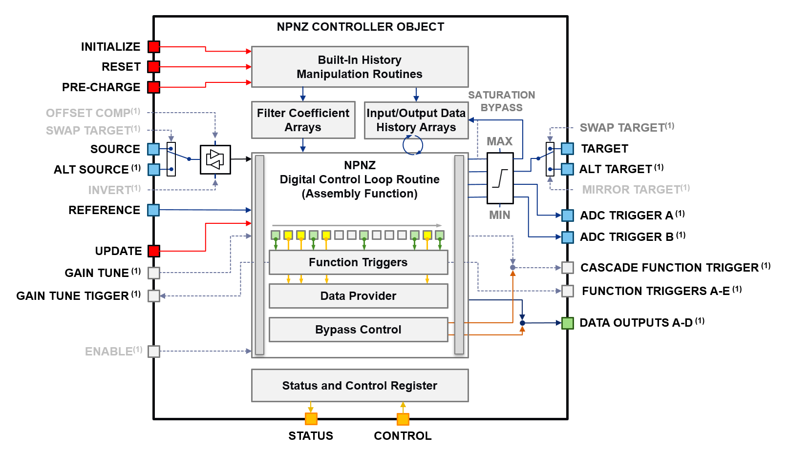
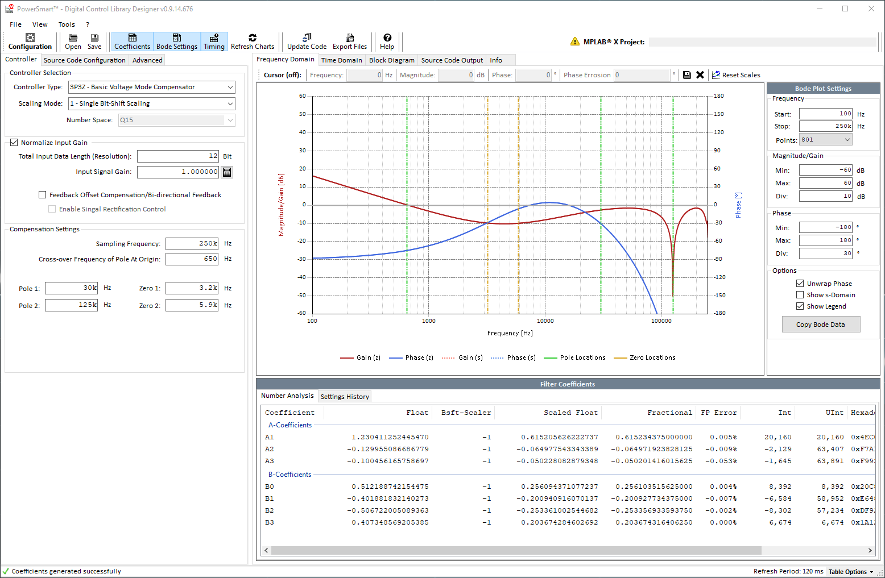
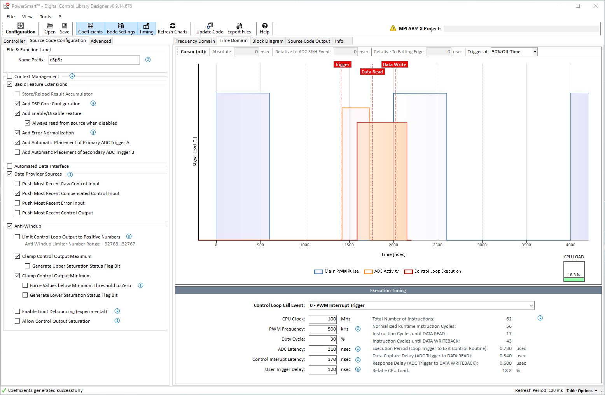
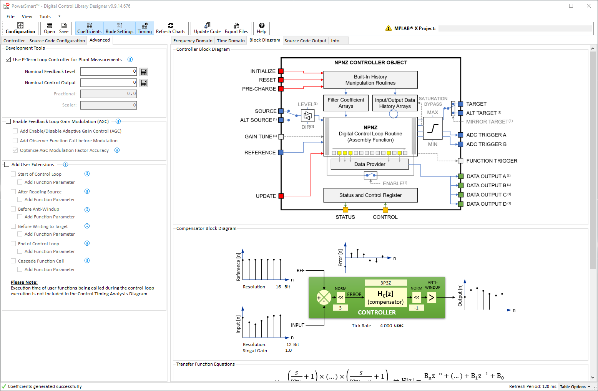
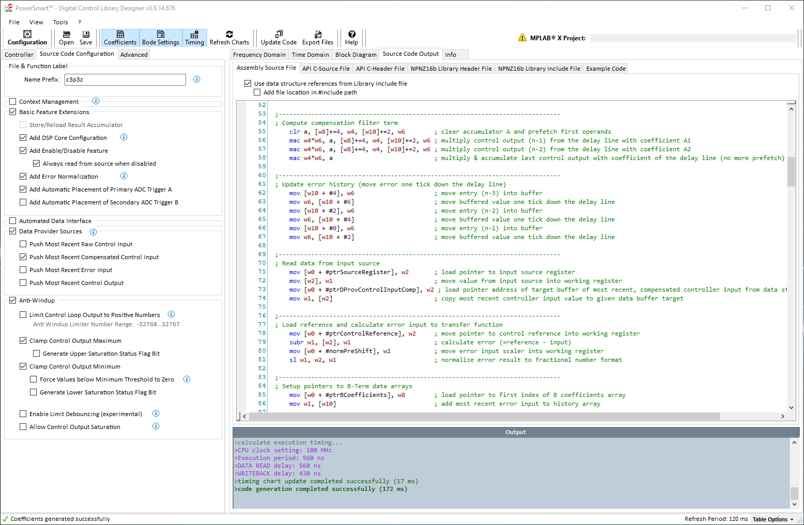
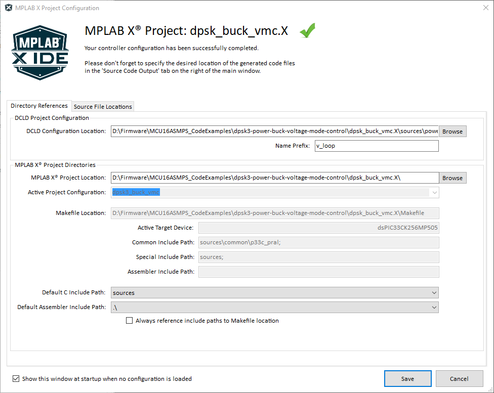
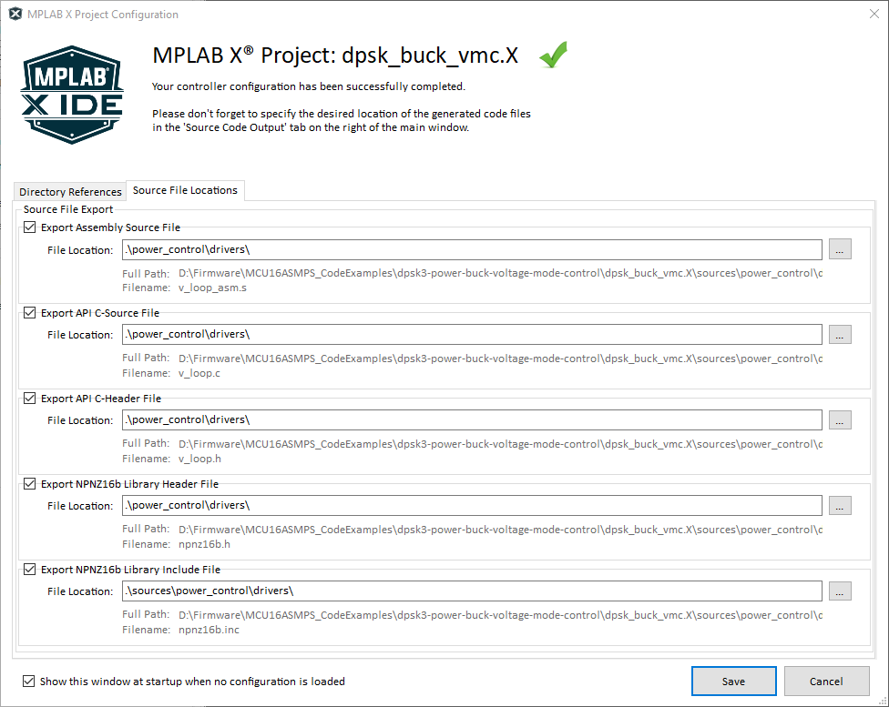
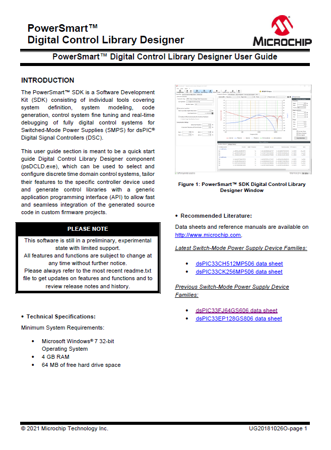

 
  <!-- start tag for internal references -->

<table width="100%">
<tr style="border:0px; background-color:#E90000; font:bold; color:#ffffff;" height="40">
<td width="330">

<a href="https://github.com/areiter128/DCLD/archive/release.zip">
Download
</a>

</td>
<td width="330">

<a href="https://github.com/areiter128/DCLD/releases" target="_blank">
Visit Release Website
</a>

</td>
<td width="330">

<a href="files/181026o_dcld_beta_user_guide.pdf" target="_blank">
View User's Guide
</a>

</td>
</tr>
</table>

# MPLAB® PowerSmart™ SDK Digital Control Library Designer  Configuration Tool & Code Generator

### MPLAB&reg; PowerSmart&trade; SDK for Microchip dsPIC33&reg; Digital Signal Controllers

The MPLAB&reg; PowerSmart&trade; SDK is a Software Development Kit (SDK) comprised of multiple, individual stand-alone tools for system definition, system modeling, code generation, control system fine tuning and real-time debugging of fully digital control systems for Switched-Mode Power Supplies (SMPS) supporting Microchip Technology’s dsPIC&reg; Digital Signal Controllers (DSC).

The major scope of this tool set is the rapid design of a digital power supply control stage rather than the power supply itself. This allows to simplify the design process to models based on interconnected transfer functions. These transfer functions are defined and configured in individual configuration windows. A transfer function can be based on generic Laplace-domain functions, being calculated at runtime or being defined by external data coming from network analyzer measurements or other third-party simulation tools such as MATLAB, SciLab, Simplis/SiMetrix, LTSpice, etc.

### Digital Control Library Designer (PS-DCLD)

This Digital Control Library Designer Configuration and Code Generation application is a sub-module of the PowerSmart&trade; SDK tool set allowing users the graphical design of discrete time domain compensation filters. The full range of supported features is described below.

## Table of Contents

- [Control Loop Configuration Tool & Code Generator Module Overview](#dcld_1)
- [Main Window Overview](#dcld_2)
- [Execution Timing Overview](#dcld_3)
- [Block Diagram Overview](#dcld_4)
- [Code Generator Output](#dcld_5)
- [MPLAB&reg; X Project Assignment](#dcld_6)
- [MPLAB&reg; PowerSmart&trade; Digital Control Library Designer User's Guide](#dcld_7)

 

## Control Loop Configuration Tool & Code Generator Module Overview

The Digital Control Library Designer allows the graphical design of discrete compensation filters from the 1st to the 6th order (1P1Z to 6P6Z). Analysis results on timing, number accuracy and resolution and support of alternative fixed- and floating point number scaling options help to tune and optimize the final SMPS controller firmware for specific needs.

The configuration window allows to enable and configure the functions and features shown in the controller block diagram below 

The output of this tool the generation of customized/tailored digital SMPS controller code libraries with standardized API, taking away the need to manually write DSP-specific source code.

The standardized API ensures seamless integration into the final firmware, supporting multiple, co-existing controllers in one firmware and seamless exchange between different controller types and scaling methods helping to solve typical performance vs. accuracy and feature tradeoffs. For simplified use during code development, the Digital Control Library Designer can be called directly from the MPLAB&reg; X Integrated Development Environment (IDE) to make changes.

### Core Features:

- Supports z-Domain Compensation Filters from 1st to 6th Order
- Fixed-Point and Floating-Point DSP Library Support
- Graphic Loop Adjustment
- Transfer Function Export
- Built-In Number Resolution Analysis and Optimization
- Graphic Execution Timing Analysis
- ANSI C/DSP Assembly Code Generation

### Special Features:

- **Advanced Control Options**
PS-DCLD provides code generator options injecting code into the real-time high speed loop allowing advanced control algorithms manipulative access to the compensation filter computation as well as data provider sources to track and monitor internal processing data at runtime. &nbsp; &nbsp;

- **System Design Options**
PS-DCLD offers alternative feedback loops enabling power supply plant measurements supporting power plant model verification and/or directly deriving essential, unknown plant transfer function information through bench tests using vector network analyzers.&nbsp; &nbsp;

- **MPLAB&reg; X Support**
PS-DCLD was developed as control library generator for Microchip dsPIC33 product families. To allow the code generator derive project settings like C include directories and selected device part number, each controller project is tightly coupled to a user-specified MPLAB® X project. For most convenient use, PS-DCLD can be opened from the MPLAB® X project manager context menu when the project file is included in the related MPLAB® X project.&nbsp; &nbsp;

- **Data Export**
Export of s-Domain and z-Domain Transfer Function (Bode Plot Data) copies the bode plot data table into the clipboard as tab-separated text table with column headers. This data can directly be pasted into external applications such as MS Excel.&nbsp; &nbsp;

[[back](#startDoc)]
 

## Main Window Overview

The main application window is divided into four sections a shown in Figure below. The graphical user interface (GUI) has been designed following Microsoft Win32 UX Guidelines to make it most intuitive to use. On the top of the window you find menus giving access to files and application functions. A command bar has been added to give quick access to most common functions of the application.

The main section of the window is divided into a User Configuration section (2) on the left. This is where all user settings are made. On the right, an Application Output section (3) shows the results of the most recent user configuration. Due to the complexity of digital compensator design, the results are split into multiple sub-sections grouped by topics (Frequency Domain, Time Domain, Block Diagram and Source Code).

The z-Domain Controller configuration window is ordered into a left configuration plane and a right plane showing the results based on recent settings. Both planes are separated in individual sub-planes (tabs) offering access to settings of individual, functional blocks. The default view starts with the controller selection and frequency domain configuration on the left and the Bode Plot graph of the transfer function on the right. Below the Bode plot a data table shows the derivation transcript of the calculation result. This table is also used to display warnings of the number accuracy analyzer.

Loop tuning is a major step in the design process of any power supply. System optimizations might require to frequently modify filter settings to solve design tradeoffs. To simplify the management of optimization iterations, the Frequency Domain View also provides access to the workflow history of the filter design process. This history table captures filter settings when code is generated, assuming generated code will be programmed into a device and measurements/bench-tests are performed.

[[back](#startDoc)]
 

## Execution Timing Overview

A robust control loop needs to be executed with a fixed sampling frequency and minimum time delay between an ADC sampling point and the related controller response write-back. Considering the time required to execute the control loop and its repetition rate, each control loop consumes a certain amount of the total available CPU bandwidth. Solving the trade-off between available CPU resources, control features and control accuracy is one of the major design objectives. 

In this context a proper timing analysis is vital to prevent timing conflicts and CPU load bottlenecks which will both inevitably bare the risk of major system failures. The executing time chart provided shows the PWM signal (main PWM pulse only), ADC trigger event and ADC conversion period, control loop execution time, controller data read event and controller response write-back event. Any change to selected control features, number resolution and filter type will automatically update the timing diagram always allowing the user to review the impact of a certain feature configuration on the available CPU resources.

[[back](#startDoc)]
 

### Block Diagram Overview

The block diagram overview shows four different block diagrams:

- NPNZ Controller Block
- Compensator Block (core block of NPNZ Controller Block)
- s- to z-Domain transfer function
- Compensator processing workflow block diagram

PS-DCLD generates code modules providing a “black box” controller with one, unified Application Programming Interface (API). The look-and-feel of the generated code blocks is like working with hardware peripherals on any MCU where the user sets the configuration and then enables the module. Once these code modules have been added to a project and the user configuration has been added to the firmware, user settings will remain valid even if controller options change, filter settings are modified or even compensators of different order or different number scaling types are selected. 

The functional diagrams on this view is providing more information about the filter type used and its mathematical form to support better understanding of the code underneath.

[[back](#startDoc)]
 

### Code Generator Output

The built-in code generator of PS-DCLD updates the generated source code in real time while the user makes changes to configurations. The generated code is displayed in individual, separated output windows for assembly and C-code modules, where the code can be reviewed and edited.

The Source Code View covers multiple sub windows for every generated code module. The generated control library source code provides four different files:

- **Optimized Assembly Code**
All runtime functions are generated as optimized assembly routines. These routines read data from and write data to a data structure (NPNZ16b_t), which holds all parameters and pointers to Special Function Registers (SFRs) and user defined variables used by the library. This data is loaded into the data structure by the C-domain initialization function. Depending on code generator options selected, additional information will be written to the data structure, from which C-domain application code can gain access (e.g. status bits, most recent calculation results, etc.)

- **C-Source File**
The C-source file contains the static default set of filter coefficients, number scaling constants and the data structure initialization function of this individual controller.

- **C-Header File**
The C-header file holds all public variable and function declarations of this individual controller, making them accessible from throughout the user firmware. 

- **Library C-Header File**
The library header contains all generic declarations of the NPNZ16b_t data structure, status bits and related global defines. This file only needs be added once per project. All declarations will be used by all individually configured controllers. 

- **Library Include File (the usage of this file is optional)**
The library include file contains Assembly references to the generic declarations of the NPNZ16b_t data structure, status bits and related global defines defined in the Library C Header file. This file only needs be added once per project. 

[[back](#startDoc)]
 

### MPLAB&reg; X Project Assignment

Configuring a control loop library using PS-DCLD, it is recommended to assign a MPLAB&reg; X project to the configuration. PS-DCLD will then read the project configuration deriving all the information necessary to provide and pre-select options for the controller device and compiler options set in the user project.  

The code generator further allows to place the generated source code files at user-defined locations to not interfere with the user source code structure and source management. 

By default, all source code files will be generated in a single location, which is the location at which the controller configuration itself will be saved to. Users ca use the project configuration dialog to declare the individual file locations as desired, including network drive locations.

&nbsp; &nbsp;

[[back](#startDoc)]
 

### MPLAB&reg; PowerSmart&trade; Digital Control Library Designer User's Guide

<table >
<tr>
<td style="text-align:top; border:0px; ">
For more information about the tool and related use cases, please review the latest version of the user's guide.
</td>
<td style="border:0px;">

</td>
</tr>
</table>

[[back](#startDoc)]

- - - 

&copy; 2021, Microchip Technology Inc.
