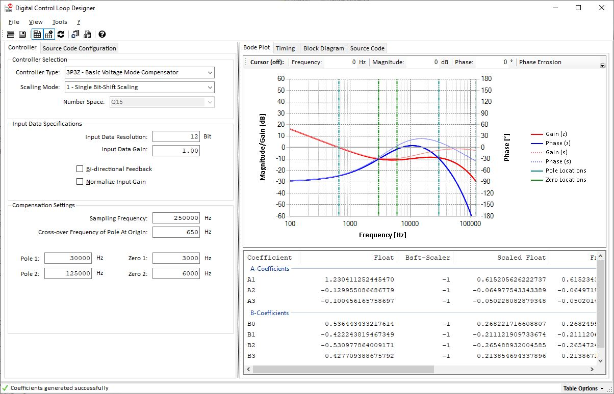

# Digital Control Library Designer SDK for Microchip dsPIC33® (DCLD)

The Digital Control Library SDK is a Software Development Kit (SDK) consisting of one basic main module combining multiple, individual stand-alone tools covering system definition, system modeling, code generation, control system fine tuning and real-time debugging of fully digital control systems for Switched-Mode Power Supplies (SMPS) supporting Microchip Technology's dsPIC® Digital Signal Controllers (DSC).

The major scope of this tool is the rapid design of a digital power supply control stage rather than the power supply itself. This allows to simplify the design process to models based on interconnected transfer functions. These transfer functions are defined and configured in individual configuration windows. A transfer function can be based on generic Laplace-domain functions being calculated at runtime or on external data coming from network analyzer measurements or other third-party simulation tools such as MATLAB, SciLab, Simplis, LTSpice, etc.

## z-Domain Loop Configuration Tool & Code Generator Module Overview

In the current version the essential functions of the z-domain configuration block of the Digital Control Library SDK is allowing the graphical design of z-Domain compensation filters from the 1st to the 6th order (1P1Z to 6P6Z), the generation of customized/tailored digital SMPS controller code libraries with standardized API, taking away the need to manually write DSP-specific source code. Analysis results on timing, number accuracy and resolution and support of alternative fixed- and floating point number scaling options help to tune and optimize the final SMPS controller firmware for specific needs.

The standardized API ensures seamless integration into the final firmware, supporting multiple, co-existing controllers in one firmware and seamless exchange between different controller types and scaling methods helping to solve typical performance vs. accuracy and feature tradeoffs.
For simplified use during code development, the z-Domain configuration window and code generator can be called directly from the MPLAB X® environment to make changes. 

(Please refer to the [PDF User Guide](./docs/latest_releases/181026g_dcld_beta_user_guide.pdf) for details)

### Core Features:
* **Supports z-Domain Compensation Filters from 1st to 6th Order**
* **Fixed-Point and Floating-Point DSP Library Support**
* **Graphic Loop Adjustment**
* **Built-In Number Resolution Analysis and Optimization**
* **Graphic Execution Timing Analysis**
* **ANSI C/DSP Assembly Code Generation**

### Special Features:
* **Data export using menu Tools => Copy To Clipboard**  
Export of s-Domain and z-Domain Transfer Function (Bode Plot Data) copies the bode plot data table into the clipboard as tab-separated text table with column headers. This data can directly be pasted into e.g. MS Excel. The data table is set to 1601 points by default ranging from 1Hz to 1MHz.  

    **Please Note:**  
    In this version the frequency range cannot be changed. A more flexible data export configuration is in preparation.

* **Coefficient Declaration**  
This is practically the content of the C-source file and therefore pretty much obsolete. You could as well just select the generated code from the C-Source window and copy it from there.

* **Coefficient Table**  
All coefficients are exported as block covering floating point, scaled floating point, fixed point, hex, int and binary number format and the rounding error. This is more for documentation than for any other reasonable use case.

* **Config File Location**  
Copies the file location of the op-code file for the assembly code generation. This is the script used to build the assembly library. Unfortunately, the C-code is not script based yet. Any larger modification affecting names or data structure elements would result in necessary changes to the DCLD code, which is not feasible. In future versions beyond v1.0 both (assembly and C) will be fully script based to allow anyone to add and modify supported controllers without the need to change to the main program.  
Nevertheless, should you decide to tweak the assembly code (e.g. comments, instructions, working registers, etc.) you can do so. In case somthing goes wrong, you find a backup file here in this repo :-)

### Further Information:

Please visit the WIKI site of this repository for more information: https://github.com/areiter128/DCLD/wiki 

### Download Software

Please visit the RELEASE websiteto download the latest release version: https://github.com/areiter128/DCLD/releases
